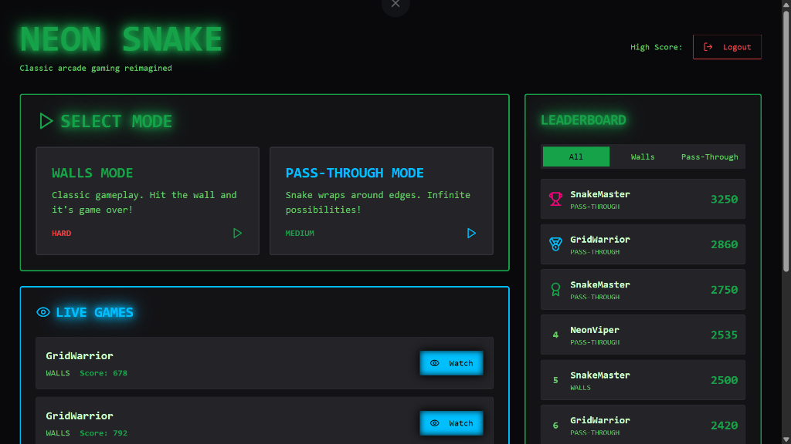
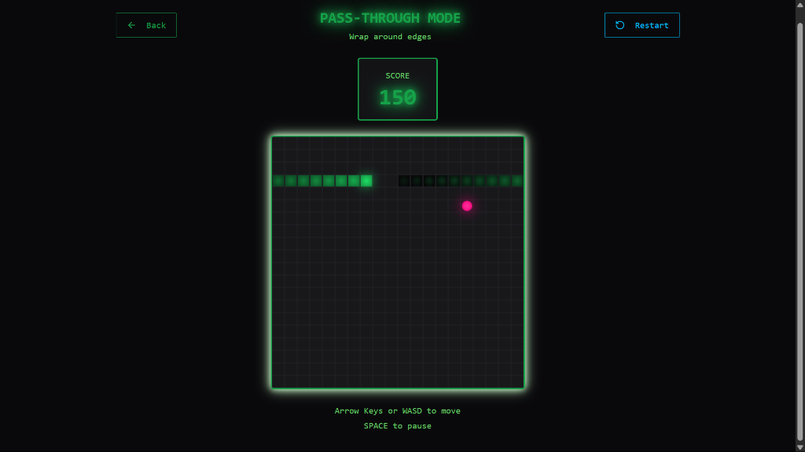

**Snake Arena** is a modern, web-based implementation of the classic Snake game, featuring user authentication, persistent leaderboards, multiple game modes, and a robust backend API.

> 🎓 This project was built as part of Module 2 of the [AI Dev Tools Zoomcamp](https://datatalks.club/blog/ai-dev-tools-zoomcamp-2025-free-course-to-master-coding-assistants-agents-and-automation.html).

## 📸 Screenshots

| Dashboard | Gameplay |
|:---------:|:--------:|
|  |  |

## ✨ Features

- **Classic Gameplay**: Enjoy the nostalgic Snake experience with modern controls.
- **Multiple Game Modes**:
  - **Pass-through**: Walls wrap around the screen.
  - **Walls**: Hitting the wall ends the game.
- **Global Leaderboard**: Compete with players worldwide for the top score.
- **User Accounts**: Sign up, log in, and track your personal high scores.
- **Responsive Design**: Play on desktop or mobile devices.

## 🚀 Tech Stack

### Frontend
- **Framework**: React 18, Vite
- **Language**: TypeScript
- **Styling**: TailwindCSS, Shadcn/UI
- **State Management**: React Query, React Hook Form
- **Testing**: Vitest, React Testing Library

### Backend
- **Framework**: FastAPI (Python 3.12+)
- **Database**: PostgreSQL
- **ORM**: SQLAlchemy
- **Migrations**: Alembic
- **Testing**: Pytest

### Infrastructure
- **Containerization**: Docker, Docker Compose
- **Hosting**: Render (Web Service + Managed Postgres)
- **CI/CD**: GitHub Actions

## 🛠️ Getting Started

### Prerequisites

- [Docker Desktop](https://www.docker.com/products/docker-desktop/) (Recommended)
- OR
- [Node.js](https://nodejs.org/) (v20+)
- [Python](https://www.python.org/) (v3.12+)
- [uv](https://github.com/astral-sh/uv) (Optional, for faster Python package management)

### Option 1: Quick Start with Docker (Recommended)

The easiest way to run the application is using Docker Compose.

1. **Clone the repository**:
   ```bash
   git clone https://github.com/YannPhamVan/snake-arena.git
   cd snake-arena
   ```

2. **Start the application**:
   ```bash
   docker-compose up -d
   ```

3. **Access the app**:
   - Frontend: [http://localhost:8080](http://localhost:8080)
   - API Docs: [http://localhost:8080/api/docs](http://localhost:8080/api/docs)

For detailed Docker instructions, see [DOCKER.md](./DOCKER.md).

### Option 2: Manual Local Development

If you prefer to run services individually for development:

#### Backend Setup

1. Navigate to the backend directory:
   ```bash
   cd backend
   ```

2. Create a virtual environment and install dependencies:
   ```bash
   # Using uv (recommended)
   uv sync
   
   # OR using pip
   python -m venv .venv
   source .venv/bin/activate  # On Windows: .venv\Scripts\activate
   pip install -r requirements.txt # Note: uses pyproject.toml normally
   ```

3. Set up the database (requires a running Postgres instance):
   ```bash
   # Update .env with your DB credentials
   cp .env.example .env
   
   # Run migrations
   alembic upgrade head
   ```

4. Start the server:
   ```bash
   uv run uvicorn app.main:app --reload --port 8000
   ```

#### Frontend Setup

1. Navigate to the frontend directory:
   ```bash
   cd frontend
   ```

2. Install dependencies:
   ```bash
   npm install
   ```

3. Start the dev server:
   ```bash
   npm run dev
   ```

4. Open [http://localhost:5173](http://localhost:5173) in your browser.

## 🧪 Running Tests

### Backend Tests
```bash
cd backend
uv run pytest
```

### Frontend Tests
```bash
cd frontend
npm test
```

## 📂 Documentation

- [DOCKER.md](./DOCKER.md): Detailed Docker and containerization guide.
- [DEPLOY.md](./DEPLOY.md): Instructions for deploying to Render.
- [AGENTS.md](./AGENTS.md): Guidelines for AI agents working on this project.

## 🤝 Contributing

1. Fork the repository.
2. Create a feature branch (`git checkout -b feature/amazing-feature`).
3. Commit your changes (`git commit -m 'Add some amazing feature'`).
4. Push to the branch (`git push origin feature/amazing-feature`).
5. Open a Pull Request.

## 📄 License

This project is licensed under the MIT License.
